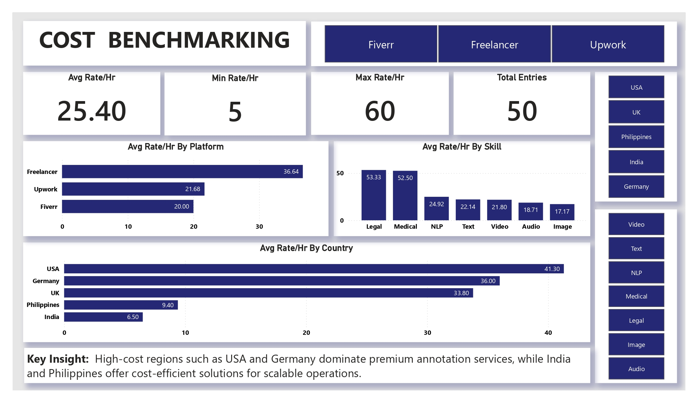
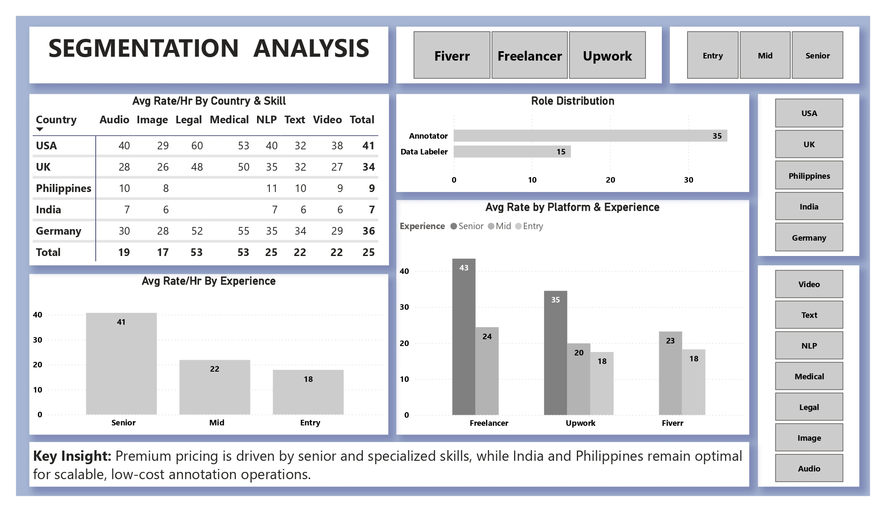

# Global Annotator Cost Benchmarking Dashboard Power BI

## Dashboard Preview

Cost Benchmarking Dashboard

Segmentation Analysis Dashboard

## Project Overview

This project analyzes global data annotation costs across countries, platforms, skills and experience levels to identify pricing patterns and cost efficient sourcing strategies.

## Objective

To build an interactive Power BI dashboard that helps in benchmarking annotator costs and supports vendor selection and decision making in data services projects.

## Key Insights

High cost regions such as USA and Germany dominate premium annotation services while India and Philippines provide cost efficient alternatives.
Specialized skills like Medical and Legal have significantly higher rates compared to general annotation tasks.
Senior level professionals command higher pricing across all platforms indicating strong experience based cost variation.
Freelancer platforms show higher average rates compared to Fiverr and Upwork in specialized domains.

## Tools Used

Power BI
Excel CSV

## Dataset

The dataset is structured using realistic market based estimates of annotator pricing across different countries, platforms, skills and experience levels for analysis purposes.
